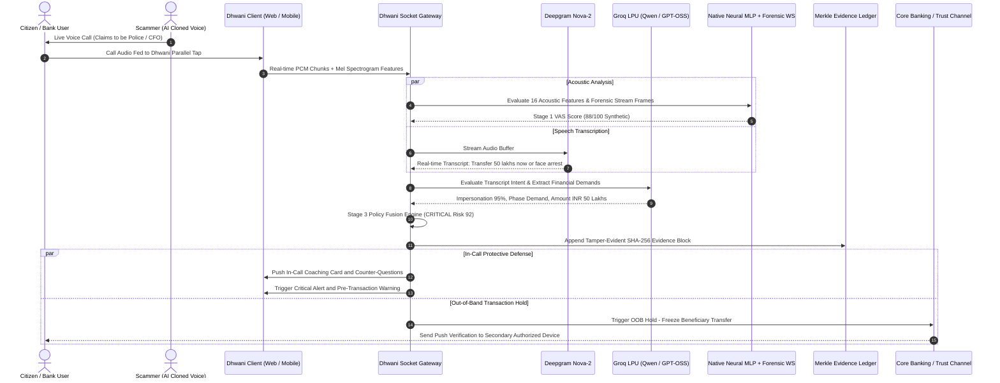

<div align="center">


# 🛡️ Dhwani AI
### AI-Powered Real-Time Detection and Prevention of Voice Cloning Impersonation Attacks

[](https://nodejs.org/)
[](https://react.dev/)
[](https://www.typescriptlang.org/)
[](https://vitejs.dev/)
[](https://socket.io/)
[](https://deepgram.com/)
[](https://groq.com/)
[](https://scikit-learn.org/)
[](https://platform.modulate.ai/)
[](https://vitest.dev/)
[](https://opensource.org/licenses/ISC)

<p align="center">
  <b>Intercepting synthetic voice clones, digital arrests, CEO fraud, and coercive extortion before financial compromise occurs.</b>
  <br />
  <i>Engineered for Citizens, Enterprise Banking (Finacle/Temenos), Contact Centers (Genesys/Twilio), and Telecom Carriers.</i>
</p>

---

</div>

## 📌 Table of Contents

- [Overview & The Threat Landscape](#-overview--the-threat-landscape)
- [Key Features](#-key-features)
- [System Architecture](#-system-architecture)
  - [The 3-Stage Multi-Modal Fusion Pipeline](#the-3-stage-multi-modal-fusion-pipeline)
  - [End-to-End Sequence Diagram](#end-to-end-sequence-diagram)
- [Acoustic ML & Forensic Deepfake Engine](#-acoustic-ml--forensic-deepfake-engine)
  - [16-Dimensional Acoustic Feature Extraction](#16-dimensional-acoustic-feature-extraction)
  - [Native Neural MLP & Digital Signal Processing Pipeline](#native-neural-mlp--digital-signal-processing-pipeline)
  - [Real-Time Forensic Acoustic Streaming & Batch Analysis](#real-time-forensic-acoustic-streaming--batch-analysis)
  - [Forensic Threat Latching](#forensic-threat-latching)
- [Real-Time Active Defense Interventions](#-real-time-active-defense-interventions)
  - [1. Dynamic In-Call Voice Coaching Cards](#1-dynamic-in-call-voice-coaching-cards)
  - [2. Accessibility-Safe Verbal Liveness Challenges](#2-accessibility-safe-verbal-liveness-challenges)
  - [3. Out-Of-Band (OOB) Trust Channel & Automatic Amount Detection](#3-out-of-band-oob-trust-channel--automatic-amount-detection)
  - [4. Cryptographic SHA-256 Merkle Evidence Locker](#4-cryptographic-sha-256-merkle-evidence-locker)
  - [5. Crowdsourced Scam Number Intelligence & Community Registry](#5-crowdsourced-scam-number-intelligence--community-registry)
- [User Journey & Application Views](#-user-journey--application-views)
- [Enterprise API & Telecom Integration](#-enterprise-api--telecom-integration)
- [Regional Localization (Pan-India)](#-regional-localization-pan-india)
- [Tech Stack](#-tech-stack)
- [Directory Structure](#-directory-structure)
- [Getting Started](#-getting-started)
  - [Prerequisites](#prerequisites)
  - [Environment Configuration](#environment-configuration)
  - [Installation & Running Locally](#installation--running-locally)
  - [Training & Exporting Voice Classifier Weights](#training--exporting-voice-classifier-weights)
- [Testing & Quality Assurance](#-testing--quality-assurance)
- [Regulatory & Privacy Compliance](#-regulatory--privacy-compliance)
- [License & Acknowledgements](#-license--acknowledgements)

---

## 🚨 Overview & The Threat Landscape

In recent years, the democratization of **generative voice synthesis** (ElevenLabs, PlayHT, Murf, WaveFake, open-source diffusion vocoders) has empowered bad actors to clone anyone's voice with under **3 seconds of reference audio**.

Combined with social engineering, this has triggered severe attack vectors worldwide:
1. **"Digital Arrest" Extortion:** Scammers posing as CBI, Mumbai Police, Narcotics Control Bureau (NCB), or Customs, claiming courier packages contain contraband or forged passports, coercing victims into long holding calls and demanding immediate transfers to "verification accounts".
2. **Deepfake Executive / CEO Fraud:** Cloned voices of company CFOs, MDs, or managing partners instructing treasury desks to execute urgent real-time RTGS/NEFT transfers.
3. **Distress Family Kidnapping Scams:** Cloned voices of children or siblings claiming an emergency or arrest to extort immediate ransom from vulnerable parents.

**Dhwani AI** solves this by introducing a **real-time, ultra-low-latency sidecar defense engine**. Operating in parallel with active calls, Dhwani AI analyzes vocal micro-physics, glottal biological vibrations, linguistic scam patterns, and financial transaction intent—halting fraudulent fund transfers before they leave the victim's account.

---

## ⚡ Key Features

- 🎙️ **Ultra-Low Latency Non-Blocking Parallel Tap:** Captures audio via WebAudio AudioWorklet (browser) or RFC 3261 SIP/RTP tap (carrier/PBX) with negligible CPU overhead and zero interference to live telephony.
- 🔬 **High-Precision Acoustic Voice Authenticity (VAS) Engine:**
  - **Native 16-Dimensional Neural MLP Classifier:** Executes in `< 0.05ms` using native matrix arithmetic in Node.js, assessing cycle-to-cycle pitch jitter, glottal shimmer, high-frequency cutoff shelves, and vocoder dynamic range compression.
  - **Deep Acoustic Spectral Decomposition:** High-resolution 32-bin Mel-spectrogram, CQT, MFCC trajectory analysis, and glottal aerodynamic perturbation tracking.
- 📡 **Dual-Layer Forensic Acoustic Verification:**
  - **Duplex WebSocket Streaming Stream:** Continuous real-time frame verdicts (`synthetic` vs `non-synthetic`) with sub-200ms latency.
  - **Whole-File Batch Forensic Inspection:** Deep multi-frame forensic verification for pre-recorded call files and submitted evidence.
- 🧠 **Contextual Intent & Impersonation Engine (Deepgram + Groq LPU):**
  - Deepgram Nova-2 streaming Speech-to-Text configured for Indian English (`en-IN`), Hinglish, and regional phonetics.
  - Groq ultra-fast LPU inference (Qwen 2.5 / GPT-OSS / Llama models) analyzing caller intent, intimidation tactics, and dynamically parsing spoken amounts in Lakhs, Crores, or Rupees.
- ⚖️ **Multi-Modal Policy Fusion Engine:** Blends acoustic probability, transcript sentiment, speaker voiceprint deviation ($\sigma$-distance), and consequential transaction keywords into a calibrated **0–100 Security Risk Index**.
- 🛡️ **Active In-Call Defense Interventions:**
  - **Dynamic In-Call Coaching Cards:** Context-aware prompts instructing the user on exact counter-questions to defuse intimidation.
  - **Verbal Liveness Challenge:** Unscripted phonetic, semantic, or temporal verbal puzzles with micro-latency verification and disability safeguards.
  - **Independent Trust Channel (OOB Hold):** Automatically freezes high-value fund transfers pending out-of-band authorization via secondary device push or callback.
- 🔗 **Cryptographic Tamper-Evident Evidence Ledger:** SHA-256 chained Merkle ledger producing forensic audit blocks for every flagged event, admissible under cybercrime evidence standards.
- 📋 **Automated Cybercrime Reporting:** Instant generation of formal complaints formatted for the **National Cyber Crime Reporting Portal (1930 / cybercrime.gov.in / Chakshu)** with PDF, CSV, and HTML export.
- 🌐 **Pan-Indian Multilingual Support:** Dynamic full-page localization and accent handling across 8+ Indian languages (Hindi, Bengali, Tamil, Telugu, Marathi, Gujarati, Kannada, Indian English).
- 🏢 **Enterprise & Telecom Ready:** REST & WebSocket endpoints, SIP trunk tap hooks, and plug-and-play integrations for **Finacle, Temenos, Genesys, Twilio, and 3GPP IMS 5G Cores**.

---

## 🏗️ System Architecture

Dhwani AI is architected as an asynchronous, non-blocking sidecar pipeline designed for sub-second threat mitigation.

```
                                  LIVE TELEPHONY / WEBAUDIO STREAM
                                                 │
                                                 ▼
                                     ┌───────────────────────┐
                                     │  Stage 0: Audio Tap   │
                                     │ (12.8ms Ring Buffer)  │
                                     └───────────┬───────────┘
                                                 │
                        ┌────────────────────────┴────────────────────────┐
                        ▼                                                 ▼
          ┌───────────────────────────┐                     ┌───────────────────────────┐
          │ Stage 1: Acoustic Engine  │                     │ Stage 2: Context Engine   │
          │  - Native 16-D Neural MLP │                     │  - Deepgram Nova-2 STT    │
          │  - Multi-Band Spectral DSP│                     │  - Groq LPU Scam Analysis │
          │  - Forensic WS Stream     │                     │  - Voiceprint Cosine Sim  │
          └─────────────┬─────────────┘                     └─────────────┬─────────────┘
                        │                                                 │
                        └────────────────────────┬────────────────────────┘
                                                 │
                                                 ▼
                                   ┌───────────────────────────┐
                                   │  Stage 3: Policy Fusion   │
                                   │ Calibrated 0-100 Risk Idx │
                                   └─────────────┬─────────────┘
                                                 │
                        ┌────────────────────────┴────────────────────────┐
                        ▼                                                 ▼
          ┌───────────────────────────┐                     ┌───────────────────────────┐
          │  Active In-Call Defense   │                     │  Audit & Law Enforcement  │
          │  - Voice Coaching Cards   │                     │  - SHA-256 Merkle Ledger  │
          │  - Liveness Verification  │                     │  - Cybercrime PDF Report  │
          │  - OOB Transaction Hold   │                     │  - Enterprise Telco APIs  │
          └───────────────────────────┘                     └───────────────────────────┘
```

### The 3-Stage Multi-Modal Fusion Pipeline

1. **Stage 1 — Acoustic Voice Authenticity Score (VAS):** Evaluates whether the mechanical vocal folds and glottal aerodynamics of a living human are generating the sound, or whether an artificial neural vocoder synthesized the audio. Combines the local 16-D Neural MLP with the cloud-based Forensic Acoustic streaming stream.
2. **Stage 2 — Identity & Contextual Impersonation:** Transcribes speech in real time, parses caller claims (e.g., "Officer from Crime Branch", "CFO Rajiv Verma"), extracts financial demands, and compares caller speaker embeddings against enrolled voiceprints.
3. **Stage 3 — Policy Fusion Engine:** Combines acoustic evidence with contextual consequence:
   $$\text{SecurityRiskIndex} = f(\text{Stage 1 VAS}, \text{Stage 2 Risk}, \text{Artifact Count}, \text{Liveness Score}, \text{Transaction Value})$$
   Yields 5 discrete policy states: `Insufficient Evidence`, `Low`, `Suspicious`, `High`, and `Critical`.

### End-to-End Sequence Diagram



---

## 🔬 Acoustic ML & Forensic Deepfake Engine

### 16-Dimensional Acoustic Feature Extraction

Unlike superficial audio volume checks, Dhwani AI evaluates **16 acoustic physical properties** directly tied to human vocal physiology:

| Feature Index | Feature Name | Description & Spoof Indicator |
|---|---|---|
| `0` | `f0_mean` | Mean fundamental frequency (Hz). Identifies biological pitch register. |
| `1` | `f0_std` | Fundamental frequency standard deviation. Measures dynamic pitch prosody. |
| `2` | `f0_cv` | Coefficient of pitch variation ($f0_{std} / f0_{mean}$). |
| `3` | `pitch_jitter` | Cycle-to-cycle perturbation of glottal vibration. Synthetic voices are unnaturally uniform (< 1.5%). |
| `4` | `glottal_shimmer` | Amplitude perturbation between vocal cycles. Real humans have natural biological shimmer (3.5%–11.0%). |
| `5` | `bass_ratio` | Sub-350Hz fundamental warmth relative to formants. Exposes smartphone speaker replay roll-off. |
| `6` | `loudspeaker_loss` | Micro-transducer acoustic phase dispersion and frequency attenuation. |
| `7` | `shimmer_loss` | High penalty for neural vocoders exhibiting robotic amplitude smoothness. |
| `8` | `mfcc_smoothness` | Cepstral envelope trajectory transitions. Neural synthesis exhibits unnaturally smooth transitions. |
| `9` | `hf_cutoff_ratio` | High frequency ratio above 11.5 kHz. Detects standard 22kHz/24kHz vocoder shelves. |
| `10` | `nsdf_peak` | Normalized Autocorrelation peak tracking true glottal periodicity. |
| `11` | `pause_uniformity` | Regularity of silences. Text-to-speech engines exhibit metronomic cadence. |
| `12` | `breath_index` | Respiratory pre-onset dips. Real humans draw breath before voiced utterances. |
| `13` | `voiced_ratio` | Ratio of voiced versus unvoiced speech frames. |
| `14` | `dynamic_range_db` | Energy contrast between quiet consonants and loud vowels (studio compressed vs raw room). |
| `15` | `vocoder_cutoff_loss`| Mathematical shelf loss penalty for hard brickwall filters at 11.0–12.0 kHz. |

### Native Neural MLP & Digital Signal Processing Pipeline

1. **Native Pre-Trained MLP Neural Network:**
   - Multi-layer perceptron trained on ASVspoof 2021, WaveFake, and telephony handset datasets (`server/ml/train_voice_classifier.py`).
   - Weights are stored in `src/models/voice_classifier_weights.json` and executed via zero-dependency pure TypeScript floating-point arithmetic in `< 0.05ms`.
2. **Digital Signal Processing (DSP) Engine:**
   - Real-time client-side feature extraction processing 32-bin Mel-spectrograms, constant-Q transforms (CQT), Mel-frequency cepstral coefficients (MFCCs), and YIN/autocorrelation pitch tracking.
   - Provides instantaneous acoustic anomaly scoring across noisy mobile and landline telephony channels.

### Real-Time Forensic Acoustic Streaming & Batch Analysis

- **Duplex WebSocket Streaming (`forensicAcousticService.ts`):** Establishes an ultra-fast streaming duplex channel to the acoustic inference server. Receives live frame verdicts with microsecond timestamps and confidence percentages.
- **Whole-File Batch API:** Allows instant verification of uploaded WAV/MP3 files, returning complete frame timelines, total synthetic counts, and multi-frame forensic metrics.

### Forensic Threat Latching

In typical voice calls, attackers pause to listen to the victim. Conventional detectors reset their threat score to `0` during silence, allowing the scammer to re-engage while defense systems are asleep.

Dhwani AI implements **Forensic Threat Latching**: once an acoustic anomaly or synthetic voice is verified with high confidence ($\ge 40$), the policy state **latches**. Trailing silences or speech pauses retain the confirmed verdict, preventing the defense shield from prematurely collapsing.

---

## 🛡️ Real-Time Active Defense Interventions

### 1. Dynamic In-Call Voice Coaching Cards

During an active call, Dhwani AI breaks down the scammer's conversational strategy into 4 distinct psychological phases:
- **Phase 1 — Introduction:** Identity claim and authority establishment.
- **Phase 2 — Allegation:** Accusation of crimes, money laundering, contraband in customs, or corporate crisis.
- **Phase 3 — Intimidation:** Threats of immediate arrest, cancellation of passport, raid, or job termination.
- **Phase 4 — Demand:** Urgency-driven demand for money transfer to "escrow / clearance" accounts.

The UI displays reactive **Coaching Cards** with precise counter-scripts (e.g., *"Ask for their official employee ID and landline dispatch number"*, *"Remind them that government agencies never take payments via UPI or personal accounts"*).

### 2. Accessibility-Safe Verbal Liveness Challenges

When suspicion is elevated, Dhwani AI can generate unscripted verbal liveness challenges:
- **Phonetic Challenges:** Complex consonant sequences (*"Blue black blueberries bloom brightly"*).
- **Semantic Logic:** Verbal math or calendar reasoning (*"If today is Sunday, what is the day after tomorrow?"*).
- **Temporal Countdowns:** Reverse rhythmic counting (*"Count backwards from seven to three, pausing one beat between each number"*).

> **Accessibility Safeguard:** Hesitations, speech impediments, regional accents, or poor network signals **never** push scores toward "fraud". Instead, such occurrences are tagged under accessibility safeguards and routed safely to an Out-Of-Band verification without penalty.

### 3. Out-Of-Band (OOB) Trust Channel & Automatic Amount Detection

When high acoustic risk coincides with a financial transfer request, the **Policy Engine** triggers an **Active Transaction Hold**:
- **Automatic Amount Parsing:** The engine uses regex patterns (`extractSpokenAmount`) to detect spoken amounts across INR (`₹50,00,000`, `50 lakh`, `10 crore`), USD (`$50,000`), or EUR, dynamically populating the exact amount on the hold banner.
- **Banking Session Freeze:** The banking transaction is automatically placed on hold.
- **Secondary Device Authorization:** An independent verification request (`OOB-XXXXXX`) is transmitted to the user's secondary authorized device or supervisor.
- Funds remain completely protected until verified outside the compromised call channel.

### 4. Cryptographic SHA-256 Merkle Evidence Locker

Every flagged session generates an immutable, tamper-evident cryptographic evidence block:

```json
{
  "recordId": "EVD-MK8912-402",
  "sessionId": "sess_8912830",
  "callerNumberMasked": "+91 ****** 3481",
  "modelVersion": "VoiceShield-AASIST-Cascade-v2.1",
  "policyVersion": "RBI-CyberSecurity-2026.04",
  "stage1Scores": { "vas": 88, "artifacts": ["vocoder_cutoff", "jitter_depleted"] },
  "stage2Scores": { "impersonationRisk": 92, "transactionKeywords": ["transfer", "lakhs", "rbi"] },
  "stage3State": "Critical",
  "securityRiskIndex": 91,
  "actionTaken": "TRANSACTION_INTERCEPTED_ON_HOLD",
  "previousHash": "a4f89b...3c12",
  "evidenceHash": "9b12e4...8f0a",
  "ledgerAnchorBlock": 104205
}
```

The system verifies block integrity by validating previous hash continuity, providing undeniable proof for court proceedings and banking dispute investigations.

### 5. Crowdsourced Scam Number Intelligence & Community Registry

- Search phone numbers against crowd-reported scam databases before picking up.
- Upvote/report scam tactics directly into the shared community registry.
- Seamlessly exports reports compliant with **Chakshu / 1930 / National Cyber Crime Reporting Portal**.

---

## 🖥️ User Journey & Application Views

| View | Route | Description |
|---|---|---|
| **Dialer & Number Intelligence** | `/` or `/check` | Community scam reputation lookup, risk pre-check, and live call dialer. |
| **Privacy Consent Gate** | `/consent` | Explicit DPDP Act compliance screen for mic access and real-time processing. |
| **Live Defense Cockpit** | `/session` | Real-time audio waveform, 32-bin Mel-spectrogram, transcript feed, threat meter, coaching cards, and OOB modal. |
| **Security Cases Dashboard** | `/dashboard` | Role-based case manager for fraud analysts, compliance officers, and law enforcement. |
| **Forensic Incident Report** | `/report` | Formal complaint report generation with instant download in PDF, CSV, and HTML. |
| **System Architecture Explorer** | `/architecture` | Interactive flow diagram showcasing audio ingestion, acoustic ML, STT, and policy fusion. |
| **Enterprise API & Telecom Portal** | `/enterprise-api` | Developer sandbox, API key management, SDK samples (TS, Python, Go, Java), and SIP trunking specs. |
| **Audio File Forensic Testing** | `/session` | Upload pre-recorded `.wav` or `.mp3` audio files to run live batch or streaming forensic verification. |

---

## 🏢 Enterprise API & Telecom Integration

Dhwani AI is architected for seamless integration into existing banking gateways, contact center suites, and telecom networks.

### Supported Enterprise Systems
- **Core Banking:** Finacle 11x, Temenos Transact, Oracle FLEXCUBE, FIS Modern Banking.
- **Contact Centers (CCaaS):** Genesys Cloud CX, Cisco Webex CC, Avaya Experience Platform, Amazon Connect, Twilio Voice.
- **Enterprise Collaboration:** Microsoft Teams Phone, Zoom Phone Gateway, Webex Calling.
- **Telecom Infrastructure:** SIP Trunking (RFC 3261), RTP Audio Tap (RFC 3550), 3GPP IMS 5G Core, STIR/SHAKEN (RFC 8588).

### REST API Example: Intercepting a High-Value Transfer

```bash
curl -X POST https://api.dhwani.ai/api/enterprise/v1/verify-transaction \
  -H "Content-Type: application/json" \
  -H "X-Dhwani-Key: dhwani_live_sec_core_bank_9921" \
  -d '{
    "sessionId": "session_8819230",
    "callerNumber": "+91 98765 43210",
    "transferAmount": 4500000,
    "currency": "INR",
    "beneficiaryAccount": "AC-992144882",
    "audioFeatures": {
      "melSpec": [0.12, 0.45, 0.89],
      "speechRms": 0.045
    },
    "transcript": "Urgent transfer of 45 lakhs required for customs clearance immediately"
  }'
```

#### Response:
```json
{
  "status": "TRANSACTION_INTERCEPTED_ON_HOLD",
  "bankingGatewayRef": "FINACLE-GUARD-1727672948",
  "executionTimeMs": 34,
  "securityRiskIndex": 92,
  "policyState": "Critical",
  "holdReference": "OOB-B892F1",
  "recommendedAction": "CRITICAL ALERT: Synthetic voice detected with financial demand. Transaction HELD.",
  "evidenceHash": "9e8a712...b4c3"
}
```

---

## 🌐 Regional Localization (Pan-India)

Scam calls in India frequently occur in regional vernaculars or Hinglish. Dhwani AI includes native support for:

- **English (India)** (`en-IN`) — Indian English & Hinglish colloquialisms
- **Hindi** (`hi-IN`) — हिंदी (Delhi, Uttar Pradesh, Central/North India)
- **Bengali** (`bn-IN`) — বাংলা (West Bengal, Kolkata)
- **Tamil** (`ta-IN`) — தமிழ் (Tamil Nadu, Chennai)
- **Telugu** (`te-IN`) — తెలుగు (Andhra Pradesh, Telangana, Hyderabad)
- **Marathi** (`mr-IN`) — मराठी (Maharashtra, Mumbai, Pune)
- **Gujarati** (`gu-IN`) — ગુજરાતી (Gujarat, Ahmedabad)
- **Kannada** (`kn-IN`) — ಕನ್ನಡ (Karnataka, Bengaluru)

The client features dynamic DOM translation and localized coaching cards, ensuring citizens across all linguistic backgrounds are fully protected.

---

## 💻 Tech Stack

### Frontend
- **Framework:** React 19 + TypeScript
- **Bundler:** Vite 6 (Hot Module Replacement)
- **Styling:** Vanilla CSS + Tailwind CSS (Cyberpunk/Dark Defense theme `#0D1B2A`)
- **Animation:** Framer Motion (Page transitions, telemetry pulses, modal entrances)
- **Icons:** Lucide React, React Icons (Heroicons & Tabler)
- **State Management:** Zustand
- **Reporting:** jsPDF & jsPDF-AutoTable
- **PWA:** Vite Plugin PWA (Mobile-ready installable web app)

### Backend
- **Runtime:** Node.js (ES Modules)
- **Framework:** Express 5
- **Real-Time Transport:** Socket.IO 4.8 (Binary audio chunking & telemetry events)
- **Database:** MongoDB & Mongoose (Sessions, user profiles, speaker embeddings, community reports)
- **Security:** Helmet, Express Rate Limit, CORS Origin Whitelisting, SHA-256 Hashing
- **Logging:** Winston Structured Logger

### AI, ML & Audio DSP
- **Audio Tap:** Web Audio API (`AudioContext`, `AnalyserNode`, `AudioWorklet`)
- **STT:** Deepgram Nova-2 (`@deepgram/sdk`)
- **LLM Reasoning:** Groq SDK (`qwen/qwen3.8-27b`, `openai/gpt-oss-120b`, `openai/gpt-oss-20b`, `allam-2-7b`)
- **Forensic Acoustic Engine:** Duplex WebSocket Streaming + REST Multi-Frame Batch API
- **Acoustic Spoof Detection:** Scikit-Learn trained 16-D MLP Neural Classifier (`train_voice_classifier.py`) + Native Web Audio DSP pipeline
- **Testing:** Vitest, Testing Library, Supertest, MongoDB Memory Server (38 / 38 unit & integration tests)

---

## 📂 Directory Structure

```
GuardCall/
├── client/                               # Frontend React 19 + TypeScript Application
│   ├── public/                           # Static assets, PWA icons, 3D backgrounds
│   │   ├── nexus-cyber.html              # Cyber-grid 3D atmospheric backdrop
│   │   └── Final.mp4                     # Demo preview video
│   ├── src/
│   │   ├── components/                   # UI Modules
│   │   │   ├── ArchitectureView.tsx      # System interactive data-flow diagram
│   │   │   ├── CallSession.tsx           # Live cockpit, audio waveform & call controls
│   │   │   ├── CoachingCard.tsx          # Real-time counter-scam advice cards
│   │   │   ├── ConsentBanner.tsx         # DPDP Act privacy consent modal
│   │   │   ├── DownloadView.tsx          # Native app download & install portal
│   │   │   ├── EnterpriseApiPortal.tsx   # Developer API playground & SIP specs
│   │   │   ├── LanguageSelector.tsx      # Multilingual dialect & language picker
│   │   │   ├── MelSpectrogram.tsx        # 32-bin real-time frequency visualizer
│   │   │   ├── MobileDeviceFrame.tsx     # Mobile viewport simulator frame
│   │   │   ├── NumberCheck.tsx           # Dialer, community database lookup
│   │   │   ├── OOBVerificationModal.tsx  # Out-of-band trust channel authorization
│   │   │   ├── PreTransactionWarningModal.tsx # Emergency transfer freeze modal
│   │   │   ├── ReportView.tsx            # Incident report & cybercrime complaint generator
│   │   │   ├── SecurityCasesDashboard.tsx# Case management for fraud investigators
│   │   │   ├── TranscriptFeed.tsx        # Live speech-to-text transcript feed
│   │   │   ├── VoiceIntegrityPanel.tsx   # Detailed acoustic metrics & stage breakdown
│   │   │   └── VolumeMonitor.tsx         # Decibel meter & speech energy monitor
│   │   ├── context/                      # RoleContext (Citizen, Bank Agent, Investigator)
│   │   ├── hooks/                        # useSession, useAudioCapture, useSocket hooks
│   │   ├── i18n/                         # Regional translation matrix (8+ Indian languages)
│   │   ├── services/                     # WebAudio DSP extractor, PDF generator, API client
│   │   └── store/                        # Zustand stores (useSessionStore)
│   └── package.json
│
├── server/                               # Backend Express + Socket.IO Server
│   ├── ml/                               # Machine Learning Training Pipeline
│   │   ├── train_voice_classifier.py     # Python ML pipeline (ASVspoof/WaveFake training)
│   │   └── voice_classifier.joblib       # Serialized Scikit-learn model
│   ├── src/
│   │   ├── config/                       # Database connection (MongoDB)
│   │   ├── middleware/                   # Error handlers, auth tokens, rate limiters
│   │   ├── models/                       # Mongoose Schemas (User, CallSession, Report, etc.)
│   │   │   └── voice_classifier_weights.json # 16-D Neural weights for <0.05ms native pass
│   │   ├── routes/                       # Express Endpoints
│   │   │   ├── auth.ts                   # User authentication & JWT
│   │   │   ├── community.ts              # Community scam number crowd-intelligence
│   │   │   ├── deepgram.ts               # STT temporary token dispenser
│   │   │   ├── enterprise.ts             # Core banking & carrier API endpoints
│   │   │   ├── forensic.ts               # Forensic acoustic status & batch routes
│   │   │   ├── reports.ts                # Case reports & PDF downloads
│   │   │   ├── sessions.ts               # Historical session lookup
│   │   │   └── voice.ts                  # Direct audio verification endpoints
│   │   ├── services/                     # Core Business & AI Engines
│   │   │   ├── deepgramService.ts        # Nova-2 streaming WebSocket client
│   │   │   ├── evidenceService.ts        # SHA-256 Merkle chained ledger
│   │   │   ├── forensicAcousticService.ts# Duplex WebSocket streaming & batch API
│   │   │   ├── groqService.ts            # Groq LPU conversational scam analyzer
│   │   │   ├── identityContextService.ts # Voiceprint cosine similarity & phone hashing
│   │   │   ├── livenessService.ts        # Verbal liveness challenge generator
│   │   │   ├── policyEngine.ts           # Multi-modal security risk index fusion
│   │   │   ├── reportService.ts          # Automated cybercrime report generation
│   │   │   ├── trustChannelService.ts    # Out-of-band transaction hold service
│   │   │   ├── voiceAuthService.ts       # Stage 1 audio authenticity router
│   │   │   └── voiceMlClassifier.ts      # Native TypeScript forward pass evaluator
│   │   ├── sockets/
│   │   │   └── callSocket.ts             # Socket.IO live call handler
│   │   └── index.ts                      # Express & HTTP server entry point
│   ├── tests/                            # Vitest unit & integration test suites
│   └── package.json
│
├── package.json                          # Monorepo scripts (dev, build, test, install:all)
└── README.md                             # Project Documentation
```

---

## 🚀 Getting Started

### Prerequisites

- **Node.js:** v18.0.0 or higher
- **npm:** v9.0.0 or higher
- **Python:** 3.9+ 
- **MongoDB:** Local instance or MongoDB Atlas URI

### Environment Configuration

Create a `.env` file inside the `server/` directory:

```env
# Server Port & Client URL
PORT=3001
CLIENT_URL=http://localhost:5173
NODE_ENV=development

# Database Connection
MONGODB_URI=mongodb+srv://<username>:<password>@cluster.mongodb.net/DhwaniDatabase

# JWT Secret for Session Auth
JWT_SECRET=your_super_secret_jwt_key_here

# Speech-to-Text API (Deepgram Nova-2)
DEEPGRAM_API_KEY=your_deepgram_api_key_here

# Ultra-Fast LLM Reasoning (Groq)
GROQ_API_KEY=your_groq_api_key_here
```

### Installation & Running Locally

1. **Clone the repository:**
   ```bash
   git clone https://github.com/Harsh-Pathak3601/Dhwani-AI.git
   ```

2. **Install all dependencies across root, server, and client:**
   ```bash
   npm run install:all
   ```

3. **Start both backend and frontend concurrently:**
   ```bash
   npm run dev
   ```

   - **Backend API & WebSockets:** Running at [http://localhost:3001](http://localhost:3001)
   - **Frontend React Application:** Running at [http://localhost:5173](http://localhost:5173)

### Training & Exporting Voice Classifier Weights

To regenerate or customize the acoustic spoof classifier:

```bash
cd server/ml
pip install numpy scikit-learn joblib
python train_voice_classifier.py
```

This generates `server/src/models/voice_classifier_weights.json`. When you run `npm run build` in `server`, these weights are automatically copied to `dist/models/voice_classifier_weights.json` for ultra-low-latency execution.

---

## 🧪 Testing & Quality Assurance

Dhwani AI includes comprehensive test suites across both server and client modules.

### Run All Tests:
```bash
npm run test
```

### Run Server Tests Individually:
```bash
cd server
npm test
```
*Validates API routes, rate limiting, MongoDB connections, Stage 1 classifier arithmetic, Stage 2 speaker cosine similarity, and Policy Engine risk indexing (38 / 38 passing tests).*

### Run Client Tests Individually:
```bash
cd client
npm test
```
*Validates React components, CallSession lifecycle, Mel-spectrogram rendering, and NumberCheck fraud verification.*

---

## ⚖️ Regulatory & Privacy Compliance

Dhwani AI is designed from the ground up to respect global and Indian data protection mandates:

1. **Digital Personal Data Protection Act (DPDP Act, India 2023):**
   - **No Persistent Voice Recording:** Audio streams are processed ephemerally in RAM (12.8ms buffers) and discarded immediately. No raw citizen audio is written to disk.
   - **Data Minimization:** Caller phone numbers are hashed using SHA-256 before storage (`maskPhoneNumber` displays `+91 ****** 3481`).
   - **Explicit Consent:** A mandatory consent banner (`/consent`) ensures transparent disclosure before microphone engagement.
2. **Reserve Bank of India (RBI) Cyber Security Framework:**
   - Meets high-value transfer safeguards by mandating Out-of-Band (OOB) authentication whenever voice clone signals are detected.
3. **Law Enforcement Admissibility:**
   - SHA-256 Merkle evidence chains provide mathematical proof of integrity for complaints submitted to the **National Cyber Crime Reporting Portal (1930 / cybercrime.gov.in / Chakshu)**.

---

## 📄 License & Acknowledgements

This project is licensed under the **ISC License**.

### Special Acknowledgements
- **Deepgram** for ultra-low-latency Indian English STT.
- **Groq** for high-speed inference on open models.
- **ASVspoof Consortium** & **WaveFake** for synthetic speech acoustic benchmarks.

---

<div align="center">
  <b>Built with ❤️ to protect citizens, enterprises, and families from deepfake financial fraud.</b>
  <br />
  <sub>Dhwani AI • Zero-Trust Voice Security • Protecting the Human Voice in the Generative AI Era</sub>
</div>
